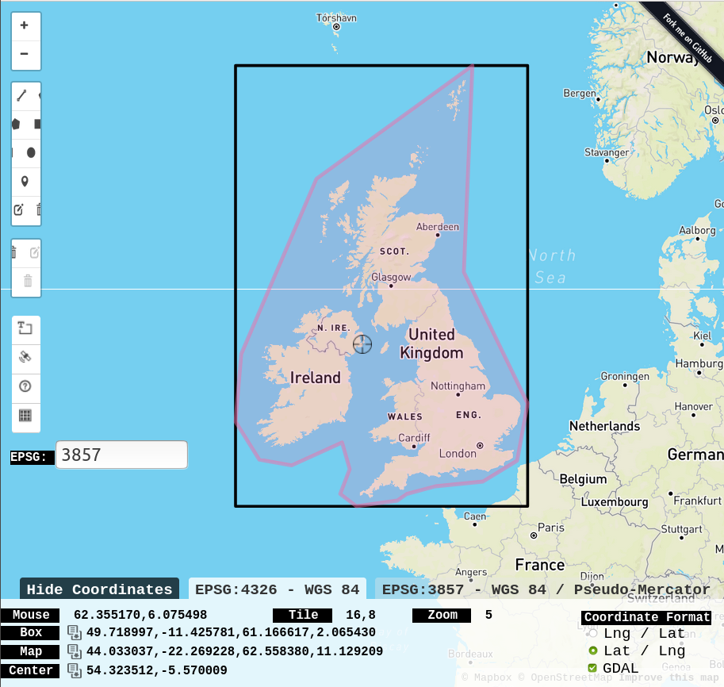

# xeno-canto

API Info:
* https://www.xeno-canto.org/explore/api

API Search tips:
* https://www.xeno-canto.org/help/search

GUI advanced search form:
* https://www.xeno-canto.org/explore?query=+cnt%3A%22%3DUnited+Kingdom%22&view=2&dir=0&order=cnt
* https://www.xeno-canto.org/explore?query=+cnt%3A%22%3DUnited+Kingdom%22&view=2&dir=0&order=cnt

Map search tool:
* https://www.xeno-canto.org/explore/region

_____________

## Request

The endpoint for the web service is at:

https://www.xenocanto.org/api/2

### Request parameters:

1. ### query
    * required and must be non-empty
    * search string, format tips in: https://www.xeno-canto.org/help/search
2. ### page
    * optional and only required if more than 1 page returned
    * integer between 1 and `result.numPages`

### Example

https://www.xeno-canto.org/api/2/recordings?query=cnt:%22=United%20Kingdom%22+q:a&page=3

* https://www.xeno-canto.org/api/2/recordings?
* query=
    * cnt:%22=United%20Kingdom%22
    * +q:a
* &page=3

_____________

## Result

A successful query returns HTTP 200 response code, with a payload in form:

    {
        "numRecordings": "1",
        "numSpecies": "1",
        "page": 1,
        "numPages": 1,
        "recordings": [
            ...,
            Array of Recording objects (see below),
            ...
        ]
    }

### Error

In case of an error, a HTTP 400 or 500 response code will be returned (depending on whether the error was a client or server error). The payload returned will be of the following form:

    {
        "error": {
            "code":"missing_parameter",
            "message":"No query specified"
        }
    }            

The code parameter will be an identifier for the error, and message will offer some additional explanatory details.

            
### Recordings Object

Each object in the recordings array has the following format:

    {
        "id": "477551",
        "gen": "Troglodytes",
        "sp": "troglodytes",
        "ssp": "troglodytes",
        "en": "Eurasian Wren",
        "rec": "\u00c9tienne Leroy",
        "cnt": "Poland",
        "loc": "Hajn\u00f3wka, hajnowski, podlaskie",
        "lat": "52.6907",
        "lng": "23.6035",
        "alt": "160",
        "type": "song",
        "url": "\/\/www.xeno-canto.org\/477551",
        "file": "\/\/www.xeno-canto.org\/477551\/download",
        "file-name": "XC477551-190503-Troglodyte mignon@Sacharewo.mp3",
        "sono": {
            "small": "\/\/www.xeno-canto.org\/sounds\/uploaded\/ZWAQHOJFLZ\/ffts\/XC477551-small.png",
            "med": "\/\/www.xeno-canto.org\/sounds\/uploaded\/ZWAQHOJFLZ\/ffts\/XC477551-med.png",
            "large": "\/\/www.xeno-canto.org\/sounds\/uploaded\/ZWAQHOJFLZ\/ffts\/XC477551-large.png",
            "full": "\/\/www.xeno-canto.org\/sounds\/uploaded\/ZWAQHOJFLZ\/ffts\/XC477551-full.png"
        },
        "lic": "\/\/creativecommons.org\/licenses\/by-nc-sa\/4.0\/",
        "q": "A",
        "length": "1:13",
        "time": "08:00",
        "date": "2019-05-03",
        "uploaded": "2019-05-29",
        "also": [
            "Fringilla coelebs"
        ],
        "rmk": "Singing seated or in flight",
        "bird-seen": "yes",
        "playback-used": "no"
    }
     

### Description of the fields in recording objects:

| field         | description
| ---           | ---
| id            | the catalogue number of the recording on xeno-canto
| gen           | the generic name of the species
| sp            | the specific name (epithet) of the species
| ssp           | the subspecies name (subspecific epithet) 
| en            | the English name of the species 
| rec           | the name of the recordist
| cnt           | the country where the recording was made
| loc           | the name of the locality
| lat           | the latitude of the recording in decimal coordinates
| lng           | the longitude of the recording in decimal coordinates
| type          | the sound type of the recording (e.g. 'call', 'song', etc). This is generally a comma-separated list of sound types.
| url           | the URL specifying the details of this recording
| file          | the URL to the audio file
| file-name     | the original file name of the audio file
| sono          | an object with the urls to the four versions of sonograms
| lic           | the URL describing the license of this recording
| q             | the current quality rating for the recording
| length        | the length of the recording in minutes
| time          | the time of day that the recording was made
| date          | the date that the recording was made
| uploaded      | the date that the recording was uploaded to xeno-canto
| also          | an array with the identified background species in the recording
| rmk           | additional remarks by the recordist
| bird-seen     | was the recorded bird visually identified? (yes/no)
| playback-used | was playback used to lure the bird? (yes/no)

__________________

## Sample request

### API search for UK / Ireland:
* https://www.xeno-canto.org/api/2/recordings?query=cnt:%22=United%20Kingdom%22 
* https://www.xeno-canto.org/api/2/recordings?query=cnt:%22=Ireland%22

### GUI advanced search form for UK / Ireland:
* https://www.xeno-canto.org/explore?query=+cnt%3A%22%3DUnited+Kingdom%22&view=2&dir=0&order=cnt
* https://www.xeno-canto.org/explore?query=%20cnt%3A%22%3DIreland%22

### Bounding box covering UK and Ireland:
* https://www.xeno-canto.org/api/2/recordings?query=box:49.718997,-11.425781,61.166617,2.065430
* query=box:49.718997,-11.425781,61.166617,2.065430
* Bounding fox obtained from: http://bboxfinder.com/#49.718997,-11.425781,61.166617,2.065430

